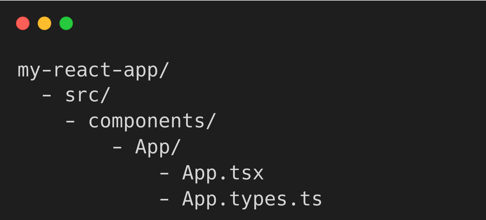

# React + Vite

This template provides a minimal setup to get React working in Vite with HMR and some ESLint rules.

Currently, two official plugins are available:

- [@vitejs/plugin-react](https://github.com/vitejs/vite-plugin-react/blob/main/packages/plugin-react/README.md) uses [Babel](https://babeljs.io/) for Fast Refresh
- [@vitejs/plugin-react-swc](https://github.com/vitejs/vite-plugin-react-swc) uses [SWC](https://swc.rs/) for Fast Refresh

Налаштування та організація проєкту на React
Вітаємо тебе не фінішній прямій! Готуйся до другого модуля нашого курсу, де ми розглянемо React - потужну бібліотеку для створення веб інтерфейсів.

Сьогодні наш план роботи складається з наступних пунктів:

Налаштування та створення проєкту на React;
Підходи до типізації у React;
Використання хуків, їх типізація;
Принципи типізації подій.

Бажаємо успіхів!

////Створення нового проєкту/////

Для створення нового проекту React з TypeScript, використовуємо популярний інструмент для збірки проектів - Vite. 

Виконайте наступну команду у терміналі:

npm create vite@latest my-react-app -- --template react-ts

my-react-app - це назва вашого нового проекту, тобто ім'я папки. Ви можете ввести будь-яке ім'я.
-template react-ts - прапорець, що вказує Vite використовувати шаблон React із TypeScript для нового проекту.

Ця команда створить новий каталог з назвою вашого проекту та додасть стартові файли проекту. Далі необхідно:

Перейти в папку проекту командою cd.
Встановити всі необхідні залежності командою npm install.
Запустити веб-сервер для розробки командою npm run dev.

//Міграція проєкту на TypeScript//

Якщо у вас вже є React-проєкт на Vite і ви хочете додати TypeScript, виконайте наступні кроки в терминалі в папці проєкта.

Крок 1/8

Встановіть TypeScript та типи для React:

npm install --save-dev typescript @types/react @types/react-dom

Це встановить TypeScript у ваш проєкт, а також типи для бібліотек React та ReactDOM, які надають автозаповнення та перевірку типів для API цих бібліотек.

Крок 2/8

У файлі packages.json замініть:

"build": "vite build"

на 👇

"build": "tsc && vite build"

Крок 3/8

Перейменуйте файли vite.config.js та main.jsx на vite.config.ts та main.tsx відповідно.

Крок 4/8

У файлі main.tsx типізуйте кореневий елемент. Для цього після document.getElementById("root") додайте as HTMLElement.

ReactDOM.createRoot(document.getElementById("root") as HTMLElement).render(
  <React.StrictMode>
    <App />
  </React.StrictMode>
);

Крок 5/8

Налаштуйте TypeScript, створивши два файли в корені проєкту. Ці файли містять конфігурацію TypeScript для проєкту.

tsconfig.json

{
  "compilerOptions": {
    "target": "ESNext",
    "useDefineForClassFields": true,
    "lib": ["DOM", "DOM.Iterable", "ESNext"],
    "allowJs": true,
    "skipLibCheck": true,
    "esModuleInterop": false,
    "allowSyntheticDefaultImports": true,
    "strict": true,
    "forceConsistentCasingInFileNames": true,
    "module": "ESNext",
    "moduleResolution": "Node",
    "resolveJsonModule": true,
    "isolatedModules": true,
    "noEmit": true,
    "jsx": "react-jsx"
  },
  "include": ["src"],
  "references": [{ "path": "./tsconfig.node.json" }]
}

tsconfig.node.json

{
  "compilerOptions": {
    "composite": true,
    "module": "ESNext",
    "moduleResolution": "Node",
    "allowSyntheticDefaultImports": true
  },
  "include": ["vite.config.ts"]
}

Крок 6/8

Створіть файл із назвою vite-env.d.ts всередині папки src та скопіюйте та вставте цей вміст (з трьома слешами на початку):

/// <reference types="vite/client" />

Крок 7/8

У файлі index.html потрібно змінити ім'я скрипта зі старого main.jsx на main.tsx, як показано нижче:

Крок 8/8

Залишилося перейменувати файли проєкту. Файли TypeScript мають розширення .ts для файлів без JSX та .tsx для файлів з JSX. Вам потрібно перейменувати всі файли .js і .jsx на .ts і .tsx відповідно.

Ви можете це робити поетапно, оскільки в конфігурації TypeScript ми вказали опцію "allowJs": true, що дозволяє проєкту змішувати файли TypeScript та JavaScript.

/////Структура файлів та папок/////

Структура файлів та папок у проєкті може значно відрізнятися залежно від побажань розробників команди та конкретних вимог проєкту. Проте існують загальноприйняті підходи, що можуть бути відправною точкою під час організації структури проєкту.

Давайте розглянемо поширену структуру для компонентів у проєкті з TypeScript, взявши за основу компонент App.

Файли компонента згруповані усередині папки, названої відповідно до імені компонента — у нашому випадку це App. Усередині папки App знаходяться:

App.tsx — основний файл компонента.
App.types.ts — файл, який містить типи для використання у компоненті App.

При великій кількості типів або їх перевикористанні в інших частинах застосунку, такий підхід полегшує підтримку та підвищує читабельність коду.

Зауважте, що розширення файлу з типами — .ts, а не .tsx, тому що в ньому немає JSX-розмітки.

/////Використання сторонніх бібліотек/////

Іноді ви можете зіткнутися з бібліотекою, що не підтримує TypeScript з коробки. У цьому випадку вам потрібно встановити окремі визначення типів для цієї бібліотеки.

DefinitelyTyped — це репозиторій на GitHub, у якому спільнота TypeScript підтримує визначення типів для тисяч JavaScript-бібліотек.

Визначення типів для бібліотеки можна встановити за допомогою команди:

npm install --save-dev @types/ім'я_бібліотеки

Наприклад, для бібліотеки react-router-dom команда виглядатиме так:

npm install --save-dev @types/react-router-dom

Після встановлення визначень типів TypeScript автоматично використовуватиме їх під час імпорту відповідних модулів.

Зверніть увагу, що не всі бібліотеки мають визначення типів у DefinitelyTyped. У випадку, якщо ви не можете знайти типи для потрібної вам бібліотеки, вам може знадобитися створити власні визначення типів, що може бути досить складним завданням.